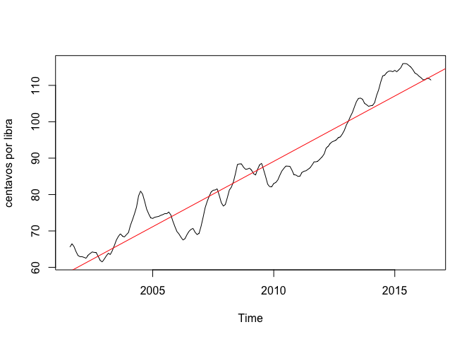

Analisis Descriptivo Series de Tiempo
================

## Gráfico de una Serie de tiempo

Vamos a analizar de forma descriptiva algunas serie de tiempo.
Empezaremos por la serie de desempleo de los Estados Unidos que viene en
el paquete TSstudio.

``` r
library(TSstudio)
data(USUnRate)
ts_info(USUnRate)
```

    ##  The USUnRate series is a ts object with 1 variable and 864 observations
    ##  Frequency: 12 
    ##  Start time: 1948 1 
    ##  End time: 2019 12

``` r
plot(USUnRate,main = "US Monthly Unemployment Rate",ylab="Unemployment Rate (%)")
```

<!-- --> La serie es
medida mensula, es decir, presenta una frecuencia de 12. Qué
carcaterísticas podemos observar? \* Tendencia? \* Estacionalidad? \*
Cíclos? \* Varianza marginal no constante? Vamos a seleccionar un
periodo de tiempo mas corto

``` r
 unemployment <- window(USUnRate, start = c(1990,1))
   ts_plot(unemployment,
           title = "US Monthly Unemployment Rate",
           Ytitle = "Unemployment Rate (%)",
           Xtitle = "Year",
           Xgrid = TRUE,
Ygrid = TRUE)
```

    ## PhantomJS not found. You can install it with webshot::install_phantomjs(). If it is installed, please make sure the phantomjs executable can be found via the PATH variable.

<div id="htmlwidget-6881727a69f443e58e50" style="width:672px;height:480px;" class="plotly html-widget"></div>
<script type="application/json" data-for="htmlwidget-6881727a69f443e58e50">{"x":{"visdat":{"158a435e8ca8":["function () ","plotlyVisDat"]},"cur_data":"158a435e8ca8","attrs":{"158a435e8ca8":{"x":{},"y":{},"mode":"lines","line":{"width":2,"dash":null,"color":"#00526d"},"alpha_stroke":1,"sizes":[10,100],"spans":[1,20],"type":"scatter"}},"layout":{"margin":{"b":40,"l":60,"t":25,"r":10},"xaxis":{"domain":[0,1],"automargin":true,"title":"Year","showgrid":true},"yaxis":{"domain":[0,1],"automargin":true,"title":"Unemployment Rate (%)","showgrid":true},"title":"US Monthly Unemployment Rate","hovermode":"closest","showlegend":false},"source":"A","config":{"showSendToCloud":false},"data":[{"x":[1990,1990.08333333333,1990.16666666667,1990.25,1990.33333333333,1990.41666666667,1990.5,1990.58333333333,1990.66666666667,1990.75,1990.83333333333,1990.91666666667,1991,1991.08333333333,1991.16666666667,1991.25,1991.33333333333,1991.41666666667,1991.5,1991.58333333333,1991.66666666667,1991.75,1991.83333333333,1991.91666666667,1992,1992.08333333333,1992.16666666667,1992.25,1992.33333333333,1992.41666666667,1992.5,1992.58333333333,1992.66666666667,1992.75,1992.83333333333,1992.91666666667,1993,1993.08333333333,1993.16666666667,1993.25,1993.33333333333,1993.41666666667,1993.5,1993.58333333333,1993.66666666667,1993.75,1993.83333333333,1993.91666666667,1994,1994.08333333333,1994.16666666667,1994.25,1994.33333333333,1994.41666666667,1994.5,1994.58333333333,1994.66666666667,1994.75,1994.83333333333,1994.91666666667,1995,1995.08333333333,1995.16666666667,1995.25,1995.33333333333,1995.41666666667,1995.5,1995.58333333333,1995.66666666667,1995.75,1995.83333333333,1995.91666666667,1996,1996.08333333333,1996.16666666667,1996.25,1996.33333333333,1996.41666666667,1996.5,1996.58333333333,1996.66666666667,1996.75,1996.83333333333,1996.91666666667,1997,1997.08333333333,1997.16666666667,1997.25,1997.33333333333,1997.41666666667,1997.5,1997.58333333333,1997.66666666667,1997.75,1997.83333333333,1997.91666666667,1998,1998.08333333333,1998.16666666667,1998.25,1998.33333333333,1998.41666666667,1998.5,1998.58333333333,1998.66666666667,1998.75,1998.83333333333,1998.91666666667,1999,1999.08333333333,1999.16666666667,1999.25,1999.33333333333,1999.41666666667,1999.5,1999.58333333333,1999.66666666667,1999.75,1999.83333333333,1999.91666666667,2000,2000.08333333333,2000.16666666667,2000.25,2000.33333333333,2000.41666666667,2000.5,2000.58333333333,2000.66666666667,2000.75,2000.83333333333,2000.91666666667,2001,2001.08333333333,2001.16666666667,2001.25,2001.33333333333,2001.41666666667,2001.5,2001.58333333333,2001.66666666667,2001.75,2001.83333333333,2001.91666666667,2002,2002.08333333333,2002.16666666667,2002.25,2002.33333333333,2002.41666666667,2002.5,2002.58333333333,2002.66666666667,2002.75,2002.83333333333,2002.91666666667,2003,2003.08333333333,2003.16666666667,2003.25,2003.33333333333,2003.41666666667,2003.5,2003.58333333333,2003.66666666667,2003.75,2003.83333333333,2003.91666666667,2004,2004.08333333333,2004.16666666667,2004.25,2004.33333333333,2004.41666666667,2004.5,2004.58333333333,2004.66666666667,2004.75,2004.83333333333,2004.91666666667,2005,2005.08333333333,2005.16666666667,2005.25,2005.33333333333,2005.41666666667,2005.5,2005.58333333333,2005.66666666667,2005.75,2005.83333333333,2005.91666666667,2006,2006.08333333333,2006.16666666667,2006.25,2006.33333333333,2006.41666666667,2006.5,2006.58333333333,2006.66666666667,2006.75,2006.83333333333,2006.91666666667,2007,2007.08333333333,2007.16666666667,2007.25,2007.33333333333,2007.41666666667,2007.5,2007.58333333333,2007.66666666667,2007.75,2007.83333333333,2007.91666666667,2008,2008.08333333333,2008.16666666667,2008.25,2008.33333333333,2008.41666666667,2008.5,2008.58333333333,2008.66666666667,2008.75,2008.83333333333,2008.91666666667,2009,2009.08333333333,2009.16666666667,2009.25,2009.33333333333,2009.41666666667,2009.5,2009.58333333333,2009.66666666667,2009.75,2009.83333333333,2009.91666666667,2010,2010.08333333333,2010.16666666667,2010.25,2010.33333333333,2010.41666666667,2010.5,2010.58333333333,2010.66666666667,2010.75,2010.83333333333,2010.91666666667,2011,2011.08333333333,2011.16666666667,2011.25,2011.33333333333,2011.41666666667,2011.5,2011.58333333333,2011.66666666667,2011.75,2011.83333333333,2011.91666666667,2012,2012.08333333333,2012.16666666667,2012.25,2012.33333333333,2012.41666666667,2012.5,2012.58333333333,2012.66666666667,2012.75,2012.83333333333,2012.91666666667,2013,2013.08333333333,2013.16666666667,2013.25,2013.33333333333,2013.41666666667,2013.5,2013.58333333333,2013.66666666667,2013.75,2013.83333333333,2013.91666666667,2014,2014.08333333333,2014.16666666667,2014.25,2014.33333333333,2014.41666666667,2014.5,2014.58333333333,2014.66666666667,2014.75,2014.83333333333,2014.91666666667,2015,2015.08333333333,2015.16666666667,2015.25,2015.33333333333,2015.41666666667,2015.5,2015.58333333333,2015.66666666667,2015.75,2015.83333333333,2015.91666666667,2016,2016.08333333333,2016.16666666667,2016.25,2016.33333333333,2016.41666666667,2016.5,2016.58333333333,2016.66666666667,2016.75,2016.83333333333,2016.91666666667,2017,2017.08333333333,2017.16666666667,2017.25,2017.33333333333,2017.41666666667,2017.5,2017.58333333333,2017.66666666667,2017.75,2017.83333333333,2017.91666666667,2018,2018.08333333333,2018.16666666667,2018.25,2018.33333333333,2018.41666666667,2018.5,2018.58333333333,2018.66666666667,2018.75,2018.83333333333,2018.91666666667,2019,2019.08333333333,2019.16666666667,2019.25,2019.33333333333,2019.41666666667,2019.5,2019.58333333333,2019.66666666667,2019.75,2019.83333333333,2019.91666666667],"y":[6,5.9,5.5,5.3,5.2,5.4,5.6,5.5,5.6,5.5,5.9,6,7.1,7.3,7.2,6.5,6.7,7,6.8,6.6,6.5,6.5,6.7,6.9,8.1,8.2,7.8,7.2,7.3,8,7.7,7.4,7.3,6.9,7.1,7.1,8,7.8,7.4,6.9,6.8,7.2,7,6.6,6.4,6.4,6.2,6.1,7.3,7.1,6.8,6.2,5.9,6.2,6.2,5.9,5.6,5.4,5.3,5.1,6.2,5.9,5.7,5.6,5.5,5.8,5.9,5.6,5.4,5.2,5.3,5.2,6.3,6,5.8,5.4,5.4,5.5,5.6,5.1,5,4.9,5,5,5.9,5.7,5.5,4.8,4.7,5.2,5,4.8,4.7,4.4,4.3,4.4,5.2,5,5,4.1,4.2,4.7,4.7,4.5,4.4,4.2,4.1,4,4.8,4.7,4.4,4.1,4,4.5,4.5,4.2,4.1,3.8,3.8,3.7,4.5,4.4,4.3,3.7,3.8,4.1,4.2,4.1,3.8,3.6,3.7,3.7,4.7,4.6,4.5,4.2,4.1,4.7,4.7,4.9,4.7,5,5.3,5.4,6.3,6.1,6.1,5.7,5.5,6,5.9,5.7,5.4,5.3,5.6,5.7,6.5,6.4,6.2,5.8,5.8,6.5,6.3,6,5.8,5.6,5.6,5.4,6.3,6,6,5.4,5.3,5.8,5.7,5.4,5.1,5.1,5.2,5.1,5.7,5.8,5.4,4.9,4.9,5.2,5.2,4.9,4.8,4.6,4.8,4.6,5.1,5.1,4.8,4.5,4.4,4.8,5,4.6,4.4,4.1,4.3,4.3,5,4.9,4.5,4.3,4.3,4.7,4.9,4.6,4.5,4.4,4.5,4.8,5.4,5.2,5.2,4.8,5.2,5.7,6,6.1,6,6.1,6.5,7.1,8.5,8.9,9,8.6,9.1,9.7,9.7,9.6,9.5,9.5,9.4,9.7,10.6,10.4,10.2,9.5,9.3,9.6,9.7,9.5,9.2,9,9.3,9.1,9.8,9.5,9.2,8.7,8.7,9.3,9.3,9.1,8.8,8.5,8.2,8.3,8.8,8.7,8.4,7.7,7.9,8.4,8.6,8.2,7.6,7.5,7.4,7.6,8.5,8.1,7.6,7.1,7.3,7.8,7.7,7.3,7,7,6.6,6.5,7,7,6.8,5.9,6.1,6.3,6.5,6.3,5.7,5.5,5.5,5.4,6.1,5.8,5.6,5.1,5.3,5.5,5.6,5.2,4.9,4.8,4.8,4.8,5.3,5.2,5.1,4.7,4.5,5.1,5.1,5,4.8,4.7,4.4,4.5,5.1,4.9,4.6,4.1,4.1,4.5,4.6,4.5,4.1,3.9,3.9,3.9,4.5,4.4,4.1,3.7,3.6,4.2,4.1,3.9,3.6,3.5,3.5,3.7,4.4,4.1,3.9,3.3,3.4,3.8,4,3.8,3.3,3.3,3.3,3.4],"mode":"lines","line":{"color":"#00526d","width":2,"dash":[]},"type":"scatter","marker":{"color":"rgba(31,119,180,1)","line":{"color":"rgba(31,119,180,1)"}},"error_y":{"color":"rgba(31,119,180,1)"},"error_x":{"color":"rgba(31,119,180,1)"},"xaxis":"x","yaxis":"y","frame":null}],"highlight":{"on":"plotly_click","persistent":false,"dynamic":false,"selectize":false,"opacityDim":0.2,"selected":{"opacity":1},"debounce":0},"shinyEvents":["plotly_hover","plotly_click","plotly_selected","plotly_relayout","plotly_brushed","plotly_brushing","plotly_clickannotation","plotly_doubleclick","plotly_deselect","plotly_afterplot","plotly_sunburstclick"],"base_url":"https://plot.ly"},"evals":[],"jsHooks":[]}</script>

Note que aquí podemos ver varias características: Estacionalidad(no es
tan evidente), tres periodos de cíclos, el primero de 1990 a 2000,el
segundo de 2000 a 2007, y el tercero de 2007 a 2019. No parece tener una
hetocedasticidad marginal.

Veamos ahora la tasa de desempleo de Colombia. Hay que hacerle un ajuste
a la base de datos porque está en order descendente en el tiempo.

## Including Plots

``` r
library(readxl)
library(tidyverse)
```

    ## ── Attaching packages ─────────────────────────────────────── tidyverse 1.3.0 ──

    ## ✓ ggplot2 3.3.3     ✓ purrr   0.3.4
    ## ✓ tibble  3.0.6     ✓ dplyr   1.0.4
    ## ✓ tidyr   1.1.2     ✓ stringr 1.4.0
    ## ✓ readr   1.4.0     ✓ forcats 0.5.1

    ## ── Conflicts ────────────────────────────────────────── tidyverse_conflicts() ──
    ## x dplyr::filter() masks stats::filter()
    ## x dplyr::lag()    masks stats::lag()

``` r
DesempleoyEmpleo <- read_excel("DesempleoyEmpleo.xlsx", range="A9:C249")
str(DesempleoyEmpleo)
```

    ## tibble [240 × 3] (S3: tbl_df/tbl/data.frame)
    ##  $ Fecha          : chr [1:240] "2020-12" "2020-11" "2020-10" "2020-09" ...
    ##  $ Tasadeempleo   : num [1:240] 53.4 53.2 53.2 50.6 49.3 ...
    ##  $ Tasadedesempleo: num [1:240] 13.4 13.3 14.7 15.8 16.8 ...

``` r
DesempleoyEmpleo_1=DesempleoyEmpleo %>% map_df(rev)
tail(DesempleoyEmpleo)
```

    ## # A tibble: 6 x 3
    ##   Fecha   Tasadeempleo Tasadedesempleo
    ##   <chr>          <dbl>           <dbl>
    ## 1 2001-06         51.8            15.2
    ## 2 2001-05         51.2            14.2
    ## 3 2001-04         51.5            14.6
    ## 4 2001-03         53.0            15.7
    ## 5 2001-02         52.7            17.3
    ## 6 2001-01         53.0            16.7

``` r
head(DesempleoyEmpleo_1)
```

    ## # A tibble: 6 x 3
    ##   Fecha   Tasadeempleo Tasadedesempleo
    ##   <chr>          <dbl>           <dbl>
    ## 1 2001-01         53.0            16.7
    ## 2 2001-02         52.7            17.3
    ## 3 2001-03         53.0            15.7
    ## 4 2001-04         51.5            14.6
    ## 5 2001-05         51.2            14.2
    ## 6 2001-06         51.8            15.2

``` r
library(zoo)
```

    ## 
    ## Attaching package: 'zoo'

    ## The following objects are masked from 'package:base':
    ## 
    ##     as.Date, as.Date.numeric

``` r
library(xts)
```

    ## 
    ## Attaching package: 'xts'

    ## The following objects are masked from 'package:dplyr':
    ## 
    ##     first, last

``` r
Fechas=as.yearmon(DesempleoyEmpleo_1$Fecha)
Desempleo_Col_xts=xts(x = DesempleoyEmpleo_1$Tasadedesempleo,frequency = 12,
order.by = Fechas)
ts_info(Desempleo_Col_xts)
```

    ##  The Desempleo_Col_xts series is a xts object with 1 variable and 240 observations
    ##  Frequency: monthly 
    ##  Start time: Jan 2001 
    ##  End time: Dec 2020

``` r
plot(Desempleo_Col_xts)
```

<!-- -->

``` r
#ts_plot(Desempleo_Col_xts,
#           title = "Tasa de Desemplo Mensual Colombia",
#           Ytitle = "Tasa de Desempleo(%)",
#           Xtitle = "Año",
#           Xgrid = TRUE,
#Ygrid = TRUE)
```

Qué características presenta esta serie?

## Análisis de Tendencias

Vamos a ver la forma de estimar la tendencia y/o eliminarla.

``` r
library(astsa)
library(TSstudio)
data(chicken)
ts_info(chicken)
```

    ##  The chicken series is a ts object with 1 variable and 180 observations
    ##  Frequency: 12 
    ##  Start time: 2001 8 
    ##  End time: 2016 7

``` r
plot(chicken,main="Precio Mensual de la Libra de Pollo en Estados Unidos", ylab="Precio en Centavos de Dólar")
```

<!-- -->

``` r
#ts_plot(chicken)
```

Al parecer la serie de precios mensuales del pollo presenta una
tendencia creciente al parecer lineal, es decir
*y*<sub>*t*</sub> = *μ*<sub>*t*</sub> + *a*<sub>*t*</sub>
o mas específicamente

*y*<sub>*t*</sub> = *β*<sub>0</sub> + *β*<sub>1</sub>*t* + *a*<sub>*t*</sub>

``` r
summary(fit <- lm(chicken~time(chicken), na.action=NULL))
```

    ## 
    ## Call:
    ## lm(formula = chicken ~ time(chicken), na.action = NULL)
    ## 
    ## Residuals:
    ##     Min      1Q  Median      3Q     Max 
    ## -8.7411 -3.4730  0.8251  2.7738 11.5804 
    ## 
    ## Coefficients:
    ##                 Estimate Std. Error t value Pr(>|t|)    
    ## (Intercept)   -7.131e+03  1.624e+02  -43.91   <2e-16 ***
    ## time(chicken)  3.592e+00  8.084e-02   44.43   <2e-16 ***
    ## ---
    ## Signif. codes:  0 '***' 0.001 '**' 0.01 '*' 0.05 '.' 0.1 ' ' 1
    ## 
    ## Residual standard error: 4.696 on 178 degrees of freedom
    ## Multiple R-squared:  0.9173, Adjusted R-squared:  0.9168 
    ## F-statistic:  1974 on 1 and 178 DF,  p-value: < 2.2e-16

``` r
plot(chicken, ylab="cents per pound") 
abline(fit,col = "red") # Se añade la recta ajusta
```

<!-- -->
