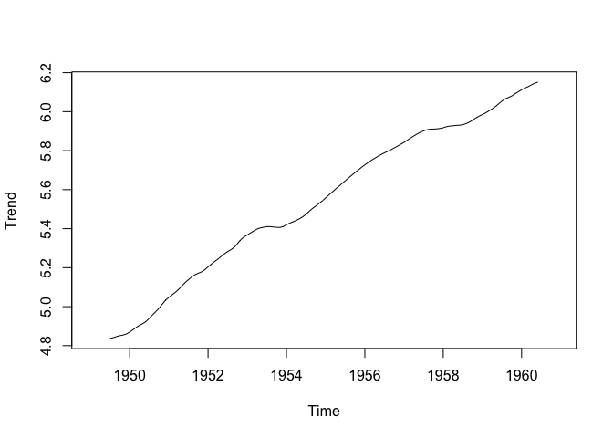
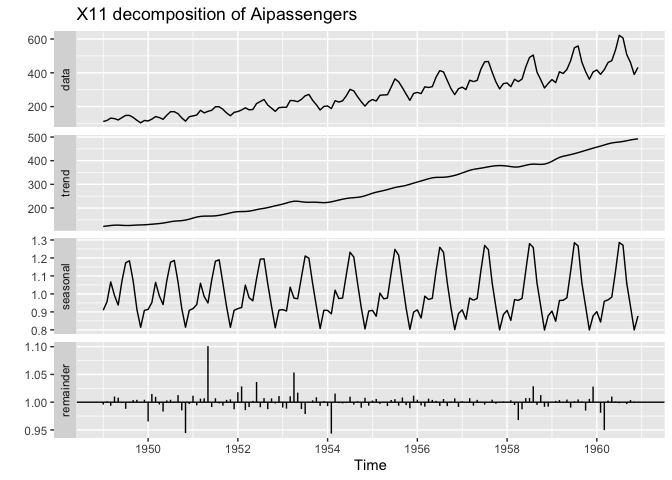
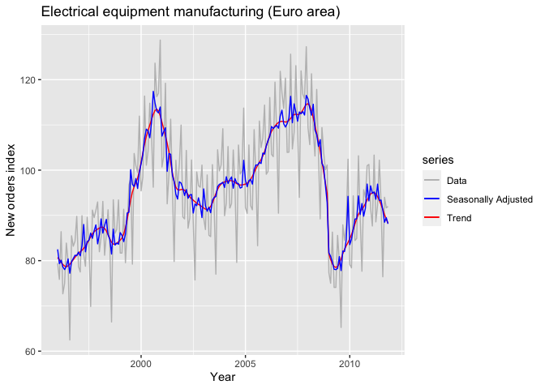
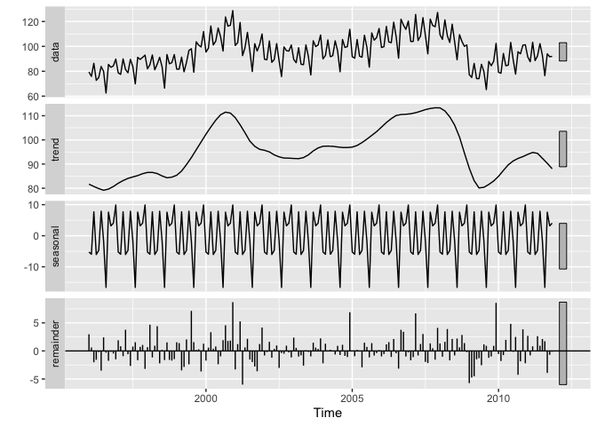

Descomposición
================

## Métodos de Descomposición de Series de tiempo

Vamos a hacer un análisis Inicial a la serie de pasajeros. Un análisis
similar deberá hacerse para las series ISE y ACC de la Base de datos
Base\_Accidentes.xlsx,

Las primeras tres metodologías se basarán en el supuesto que una serie
de tiempo observable puede ser descompuesta en una componente de
tendencia y una componente estacional, es decir, \(\{X_{t}\}\) puede
descomponerse de la siguiente forma aditiva \[
X_{t}=m_{t}+S_{t}+Y_{t},
\] donde \[m_{t}:\text{función que cambia suavemente,}\]\\
\[S_{t}:\text{función de periodo conocido d,}\]\\
\[Y_{t}:\text{ruido aleatorio estacionario en el sentido débil.}\]\\ Un
modelo multiplicativo puede ser considerado como modelo alternativo al
aditivo, \[
X_{t}=m_{t}\times S_{t} \times Y_{t}.
\] Sin embargo es necesario primero hacer una transformación de Box-Cox
para Estabilizar la varianza marginal.

\[
 f_{\lambda}(u_{t})= 
 \lambda^{-1}(u^{\lambda}_{t}-1),   si \ u_{t} \geq 0, para\  \lambda>0
 \] o \[
 f_{\lambda}(u_{t})= \ln(u_{t}), \ si\  u_{t}>0, \ para\  \lambda=0
 \]

``` r
data("AirPassengers")
plot(AirPassengers)
#####Transformación Box-Cox
library(FitAR)
```

    ## Loading required package: lattice

    ## Loading required package: leaps

    ## Loading required package: ltsa

    ## Loading required package: bestglm

<!-- -->

``` r
library(forecast)
```

    ## Registered S3 method overwritten by 'quantmod':
    ##   method            from
    ##   as.zoo.data.frame zoo

    ## 
    ## Attaching package: 'forecast'

    ## The following object is masked from 'package:FitAR':
    ## 
    ##     BoxCox

``` r
forecast::BoxCox.lambda(AirPassengers, method = "guerrero", lower = 0, upper = 2)  
```

    ## [1] 4.102259e-05

``` r
##method="loglik"
FitAR::BoxCox(AirPassengers)
```

<!-- -->

``` r
air.arima<-arima(AirPassengers, c(0,1,1), seasonal=list(order=c(0,1,1), period=12))
FitAR::BoxCox(air.arima)
```

<!-- -->

``` r
lAirPass=log(AirPassengers)
par(mfrow=c(2,1))
plot(AirPassengers)
plot(lAirPass)
```

<!-- -->
\# Descomposición usando promedios Móviles \#\# Para tendencia

``` r
fltr <- c(1/2, rep(1, times = 11), 1/2)/12
fltr
```

    ##  [1] 0.04166667 0.08333333 0.08333333 0.08333333 0.08333333 0.08333333
    ##  [7] 0.08333333 0.08333333 0.08333333 0.08333333 0.08333333 0.08333333
    ## [13] 0.04166667

``` r
## estimate of trend
lAirPass.trend <- filter(lAirPass, filter = fltr, method = "convo", sides = 2)
## plot the trend
#x11()
plot.ts(lAirPass.trend, ylab = "Trend", cex = 1)
```

<!-- --> \# Efecto
estacional a través del tiempo

``` r
lAirPass.1T <- lAirPass - lAirPass.trend

## plot the monthly seasonal effects
plot.ts(lAirPass.1T, ylab = "Seasonal effect", xlab = "Month", cex = 1)
```

<!-- -->

``` r
## length of ts
ll <- length(lAirPass.1T)
## frequency (ie, 12)
ff <- frequency(lAirPass.1T)
## number of periods (years); %/% is integer division
periods <- ll%/%ff
## index of cumulative month
index <- seq(1, ll, by = ff) - 1
## get mean by month
mm <- numeric(ff)
for (i in 1:ff) {
  mm[i] <- mean(lAirPass.1T[index + i], na.rm = TRUE)
}
## subtract mean to make overall mean=0
mm <- mm - mean(mm)

## plot the monthly seasonal effects
plot.ts(mm, ylab = "Seasonal effect", xlab = "Month", cex = 1)
```

<!-- -->

``` r
## create ts object for season
lAirPass.seas <- ts(rep(mm, periods + 1)[seq(ll)], start = start(lAirPass.1T), 
               frequency = ff)


## random errors over time
lAirPass.err <- lAirPass - lAirPass.trend - lAirPass.seas


## plot the obs ts, trend & seasonal effect
plot(cbind(lAirPass, lAirPass.trend, lAirPass.seas, lAirPass.err), main = "", yax.flip = TRUE)
```

<!-- --> \#
Dos funciones que hacen la descomposición de forma interna y automática
Una función específica para filtros de promedios móviles también puede
ser usada y es ma del paquete forecast, donde order=d, note que hay una
ligera diferencia por el 1/2 de los datos en los extremos

``` r
lAirPass.trendma=forecast::ma(lAirPass,order=13)
lAirPass.trendma-lAirPass.trend
```

    ##                Jan           Feb           Mar           Apr           May
    ## 1949            NA            NA            NA            NA            NA
    ## 1950  1.512810e-02  1.423973e-02  7.247243e-03 -5.350492e-03 -1.711213e-02
    ## 1951  1.282887e-02  1.181921e-02  4.996403e-03 -7.646584e-03 -1.900024e-02
    ## 1952  1.244482e-02  1.330987e-02  3.621721e-03 -5.675967e-03 -1.475862e-02
    ## 1953  1.071685e-02  1.300468e-02  1.290781e-03 -7.364554e-03 -1.797100e-02
    ## 1954  1.719692e-02  1.651209e-02  5.947422e-03 -3.803631e-03 -1.519825e-02
    ## 1955  1.891739e-02  1.477354e-02  4.801362e-03 -6.100417e-03 -1.738653e-02
    ## 1956  1.793440e-02  1.444231e-02  4.375753e-03 -7.100096e-03 -1.813512e-02
    ## 1957  1.846753e-02  1.704363e-02  5.530992e-03 -6.848848e-03 -1.726450e-02
    ## 1958  1.937541e-02  2.019669e-02  5.789877e-03 -4.710728e-03 -1.547808e-02
    ## 1959  2.046853e-02  2.163660e-02  5.044631e-03 -5.294726e-03 -1.634470e-02
    ## 1960  1.977664e-02  1.887399e-02  4.286370e-03 -5.102433e-03 -1.667977e-02
    ##                Jun           Jul           Aug           Sep           Oct
    ## 1949            NA -8.120335e-03 -2.894707e-03  5.321922e-03  2.408088e-03
    ## 1950 -5.195189e-03 -6.126899e-03 -2.611319e-03  6.991687e-03  5.823260e-04
    ## 1951 -7.499763e-03 -6.083321e-03 -3.919581e-03  4.501415e-03 -1.948494e-03
    ## 1952 -6.216380e-03 -5.617452e-03 -4.354918e-03  4.552475e-03  4.386815e-04
    ## 1953 -9.356792e-03 -8.634334e-03 -1.177045e-02  4.102135e-03  2.731303e-03
    ## 1954 -7.122278e-03 -5.394282e-03 -1.122871e-02  1.495602e-03 -5.027888e-04
    ## 1955 -7.732139e-03 -5.921593e-03 -9.406489e-03 -8.436885e-05 -1.321469e-03
    ## 1956 -8.063629e-03 -6.767072e-03 -1.007387e-02  9.304104e-04 -1.143789e-03
    ## 1957 -9.548256e-03 -8.522727e-03 -1.326501e-02 -2.055703e-03 -4.500425e-03
    ## 1958 -8.604726e-03 -5.803006e-03 -1.076508e-02  2.161819e-04 -3.041795e-03
    ## 1959 -9.901859e-03 -7.299754e-03 -1.264893e-02 -3.921189e-03 -1.794406e-03
    ## 1960 -8.874584e-03            NA            NA            NA            NA
    ##                Nov           Dec
    ## 1949 -3.264284e-03  7.281250e-03
    ## 1950 -1.937730e-03  4.543173e-03
    ## 1951  6.834185e-06  7.208349e-03
    ## 1952 -1.688937e-03  6.257787e-03
    ## 1953  2.946455e-03  9.533386e-03
    ## 1954 -1.947185e-04  9.348934e-03
    ## 1955 -1.579213e-03  9.513571e-03
    ## 1956 -4.607881e-04  1.168757e-02
    ## 1957 -2.182787e-03  1.125741e-02
    ## 1958 -3.722257e-05  1.068241e-02
    ## 1959  5.144059e-04  9.046882e-03
    ## 1960            NA            NA

``` r
####Uso de la función decompose
deslAirPass=decompose(lAirPass)
plot(deslAirPass)
```

<!-- -->

``` r
deslAirPass
```

    ## $x
    ##           Jan      Feb      Mar      Apr      May      Jun      Jul      Aug
    ## 1949 4.718499 4.770685 4.882802 4.859812 4.795791 4.905275 4.997212 4.997212
    ## 1950 4.744932 4.836282 4.948760 4.905275 4.828314 5.003946 5.135798 5.135798
    ## 1951 4.976734 5.010635 5.181784 5.093750 5.147494 5.181784 5.293305 5.293305
    ## 1952 5.141664 5.192957 5.262690 5.198497 5.209486 5.384495 5.438079 5.488938
    ## 1953 5.278115 5.278115 5.463832 5.459586 5.433722 5.493061 5.575949 5.605802
    ## 1954 5.318120 5.236442 5.459586 5.424950 5.455321 5.575949 5.710427 5.680173
    ## 1955 5.488938 5.451038 5.587249 5.594711 5.598422 5.752573 5.897154 5.849325
    ## 1956 5.648974 5.624018 5.758902 5.746203 5.762051 5.924256 6.023448 6.003887
    ## 1957 5.752573 5.707110 5.874931 5.852202 5.872118 6.045005 6.142037 6.146329
    ## 1958 5.828946 5.762051 5.891644 5.852202 5.894403 6.075346 6.196444 6.224558
    ## 1959 5.886104 5.834811 6.006353 5.981414 6.040255 6.156979 6.306275 6.326149
    ## 1960 6.033086 5.968708 6.037871 6.133398 6.156979 6.282267 6.432940 6.406880
    ##           Sep      Oct      Nov      Dec
    ## 1949 4.912655 4.779123 4.644391 4.770685
    ## 1950 5.062595 4.890349 4.736198 4.941642
    ## 1951 5.214936 5.087596 4.983607 5.111988
    ## 1952 5.342334 5.252273 5.147494 5.267858
    ## 1953 5.468060 5.351858 5.192957 5.303305
    ## 1954 5.556828 5.433722 5.313206 5.433722
    ## 1955 5.743003 5.613128 5.468060 5.627621
    ## 1956 5.872118 5.723585 5.602119 5.723585
    ## 1957 6.001415 5.849325 5.720312 5.817111
    ## 1958 6.001415 5.883322 5.736572 5.820083
    ## 1959 6.137727 6.008813 5.891644 6.003887
    ## 1960 6.230481 6.133398 5.966147 6.068426
    ## 
    ## $seasonal
    ##               Jan          Feb          Mar          Apr          May
    ## 1949 -0.085815019 -0.114412848  0.018113355 -0.013045611 -0.008966106
    ## 1950 -0.085815019 -0.114412848  0.018113355 -0.013045611 -0.008966106
    ## 1951 -0.085815019 -0.114412848  0.018113355 -0.013045611 -0.008966106
    ## 1952 -0.085815019 -0.114412848  0.018113355 -0.013045611 -0.008966106
    ## 1953 -0.085815019 -0.114412848  0.018113355 -0.013045611 -0.008966106
    ## 1954 -0.085815019 -0.114412848  0.018113355 -0.013045611 -0.008966106
    ## 1955 -0.085815019 -0.114412848  0.018113355 -0.013045611 -0.008966106
    ## 1956 -0.085815019 -0.114412848  0.018113355 -0.013045611 -0.008966106
    ## 1957 -0.085815019 -0.114412848  0.018113355 -0.013045611 -0.008966106
    ## 1958 -0.085815019 -0.114412848  0.018113355 -0.013045611 -0.008966106
    ## 1959 -0.085815019 -0.114412848  0.018113355 -0.013045611 -0.008966106
    ## 1960 -0.085815019 -0.114412848  0.018113355 -0.013045611 -0.008966106
    ##               Jun          Jul          Aug          Sep          Oct
    ## 1949  0.115392997  0.210816435  0.204512399  0.064836351 -0.075271265
    ## 1950  0.115392997  0.210816435  0.204512399  0.064836351 -0.075271265
    ## 1951  0.115392997  0.210816435  0.204512399  0.064836351 -0.075271265
    ## 1952  0.115392997  0.210816435  0.204512399  0.064836351 -0.075271265
    ## 1953  0.115392997  0.210816435  0.204512399  0.064836351 -0.075271265
    ## 1954  0.115392997  0.210816435  0.204512399  0.064836351 -0.075271265
    ## 1955  0.115392997  0.210816435  0.204512399  0.064836351 -0.075271265
    ## 1956  0.115392997  0.210816435  0.204512399  0.064836351 -0.075271265
    ## 1957  0.115392997  0.210816435  0.204512399  0.064836351 -0.075271265
    ## 1958  0.115392997  0.210816435  0.204512399  0.064836351 -0.075271265
    ## 1959  0.115392997  0.210816435  0.204512399  0.064836351 -0.075271265
    ## 1960  0.115392997  0.210816435  0.204512399  0.064836351 -0.075271265
    ##               Nov          Dec
    ## 1949 -0.215845612 -0.100315075
    ## 1950 -0.215845612 -0.100315075
    ## 1951 -0.215845612 -0.100315075
    ## 1952 -0.215845612 -0.100315075
    ## 1953 -0.215845612 -0.100315075
    ## 1954 -0.215845612 -0.100315075
    ## 1955 -0.215845612 -0.100315075
    ## 1956 -0.215845612 -0.100315075
    ## 1957 -0.215845612 -0.100315075
    ## 1958 -0.215845612 -0.100315075
    ## 1959 -0.215845612 -0.100315075
    ## 1960 -0.215845612 -0.100315075
    ## 
    ## $trend
    ##           Jan      Feb      Mar      Apr      May      Jun      Jul      Aug
    ## 1949       NA       NA       NA       NA       NA       NA 4.837280 4.841114
    ## 1950 4.869840 4.881389 4.893411 4.904293 4.912752 4.923701 4.940483 4.957406
    ## 1951 5.047776 5.060902 5.073812 5.088378 5.106906 5.124312 5.138282 5.152751
    ## 1952 5.203909 5.218093 5.231553 5.243722 5.257413 5.270736 5.282916 5.292150
    ## 1953 5.367695 5.378309 5.388417 5.397805 5.403849 5.407220 5.410364 5.410294
    ## 1954 5.419628 5.428330 5.435128 5.442237 5.450659 5.461103 5.473655 5.489713
    ## 1955 5.557864 5.572693 5.587498 5.602730 5.616658 5.631189 5.645937 5.659812
    ## 1956 5.727153 5.738856 5.750676 5.760658 5.770846 5.780430 5.788745 5.796524
    ## 1957 5.842665 5.853541 5.864863 5.875490 5.885654 5.894475 5.901555 5.907026
    ## 1958 5.917360 5.922887 5.926146 5.927563 5.929657 5.930458 5.932964 5.938377
    ## 1959 5.985269 5.994078 6.003991 6.014899 6.026589 6.040709 6.054492 6.066195
    ## 1960 6.112511 6.121153 6.128381 6.137437 6.145733 6.151526       NA       NA
    ##           Sep      Oct      Nov      Dec
    ## 1949 4.846596 4.851238 4.854488 4.859954
    ## 1950 4.974380 4.991942 5.013095 5.033804
    ## 1951 5.163718 5.171454 5.178401 5.189431
    ## 1952 5.304079 5.323338 5.343560 5.357427
    ## 1953 5.408381 5.406761 5.406218 5.410571
    ## 1954 5.503974 5.516367 5.529403 5.542725
    ## 1955 5.674172 5.687636 5.700766 5.714738
    ## 1956 5.804821 5.814072 5.823075 5.832692
    ## 1957 5.910012 5.910708 5.911637 5.913829
    ## 1958 5.946188 5.956352 5.967813 5.977291
    ## 1959 6.073088 6.080733 6.091930 6.102013
    ## 1960       NA       NA       NA       NA
    ## 
    ## $random
    ##                Jan           Feb           Mar           Apr           May
    ## 1949            NA            NA            NA            NA            NA
    ## 1950 -0.0390928761  0.0693058849  0.0372357360  0.0140276822 -0.0754725800
    ## 1951  0.0147724349  0.0641462837  0.0898580408  0.0184174933  0.0495549567
    ## 1952  0.0235692221  0.0892767048  0.0130241986 -0.0321798094 -0.0389603991
    ## 1953 -0.0037655164  0.0142183907  0.0573014076  0.0748261410  0.0388394970
    ## 1954 -0.0156931430 -0.0774753636  0.0063445490 -0.0042416399  0.0136285780
    ## 1955  0.0168884187 -0.0072413171 -0.0183626190  0.0050265167 -0.0092699200
    ## 1956  0.0076357612 -0.0004254752 -0.0098872806 -0.0014090481  0.0001714859
    ## 1957 -0.0042769756 -0.0320178538 -0.0080460604 -0.0102418776 -0.0045699327
    ## 1958 -0.0025997950 -0.0464226960 -0.0526156185 -0.0623149518 -0.0262881911
    ## 1959 -0.0133498220 -0.0448545455 -0.0157509599 -0.0204393997  0.0226314823
    ## 1960  0.0063898107 -0.0380324934 -0.1086238739  0.0090064128  0.0202125426
    ##                Jun           Jul           Aug           Sep           Oct
    ## 1949            NA -0.0508840131 -0.0484145828  0.0012226079  0.0031563172
    ## 1950 -0.0351476703 -0.0155006194 -0.0261197084  0.0233788915 -0.0263218589
    ## 1951 -0.0579214701 -0.0557934329 -0.0639582039 -0.0136190649 -0.0085864324
    ## 1952 -0.0016338513 -0.0556531046 -0.0077243559 -0.0265809253  0.0042062795
    ## 1953 -0.0295513795 -0.0452309945 -0.0090045219 -0.0051571083  0.0203685746
    ## 1954 -0.0005469630  0.0259560620 -0.0140532362 -0.0119825541 -0.0073736839
    ## 1955  0.0059902707  0.0404007439 -0.0149999562  0.0039948255  0.0007629883
    ## 1956  0.0284325199  0.0238857779  0.0028504899  0.0024605216 -0.0152157267
    ## 1957  0.0351368634  0.0296663904  0.0347908579  0.0265669175  0.0138880406
    ## 1958  0.0294945574  0.0526637918  0.0816688890 -0.0096097940  0.0022419710
    ## 1959  0.0008768183  0.0409669180  0.0554418481 -0.0001967977  0.0033510501
    ## 1960  0.0153478241            NA            NA            NA            NA
    ##                Nov           Dec
    ## 1949  0.0057486713  0.0110454132
    ## 1950 -0.0610505322  0.0081538226
    ## 1951  0.0210507630  0.0228720933
    ## 1952  0.0197798277  0.0107462135
    ## 1953  0.0025848214 -0.0069512737
    ## 1954 -0.0003512869 -0.0086876484
    ## 1955 -0.0168606818  0.0131983964
    ## 1956 -0.0051103984 -0.0087919843
    ## 1957  0.0245208403  0.0035969468
    ## 1958 -0.0153947570 -0.0568931956
    ## 1959  0.0155602521  0.0021887357
    ## 1960            NA            NA
    ## 
    ## $figure
    ##  [1] -0.085815019 -0.114412848  0.018113355 -0.013045611 -0.008966106
    ##  [6]  0.115392997  0.210816435  0.204512399  0.064836351 -0.075271265
    ## [11] -0.215845612 -0.100315075
    ## 
    ## $type
    ## [1] "additive"
    ## 
    ## attr(,"class")
    ## [1] "decomposed.ts"

# Otras ténicas de descomposición

Existe mas formas de hacer de descomposición de series de tiempo, por
ejemplo está Descomposción X11 usando el paquete seasonal, cuyo
argumento teórico se puede ver el libro Seasonal Adjustment Methods and
Real Time Trend-Cycle Estimation (Statistics for Social and Behavioral
Sciences) Estela Bee Dagum, Silvia Bianconcini

``` r
library(seasonal)
library(ggplot2)
library(fpp)
```

    ## Loading required package: fma

    ## Loading required package: expsmooth

    ## Loading required package: lmtest

    ## Loading required package: zoo

    ## 
    ## Attaching package: 'zoo'

    ## The following objects are masked from 'package:base':
    ## 
    ##     as.Date, as.Date.numeric

    ## Loading required package: tseries

``` r
AirPassengers %>% seas(x11="") -> fit  #%>% Operador Pipe
autoplot(fit) + ggtitle("X11 decomposition of Aipassengers")
```

<!-- -->

``` r
data(elecequip)
autoplot(elecequip)
```

<!-- -->

``` r
elecequip %>% seas(x11="") -> fit
autoplot(elecequip, series="Data") +
  autolayer(trendcycle(fit), series="Trend") +
  autolayer(seasadj(fit), series="Seasonally Adjusted") +
  xlab("Year") + ylab("New orders index") +
  ggtitle("Electrical equipment manufacturing (Euro area)") +
  scale_colour_manual(values=c("gray","blue","red"),
                      breaks=c("Data","Seasonally Adjusted","Trend"))
```

<!-- --> \# Descomposición
STL

``` r
library(dplyr)
```

    ## 
    ## Attaching package: 'dplyr'

    ## The following objects are masked from 'package:stats':
    ## 
    ##     filter, lag

    ## The following objects are masked from 'package:base':
    ## 
    ##     intersect, setdiff, setequal, union

``` r
library(fpp)
###La base de datos "elecequip" está en en el paquete fpp
###Note que el operador %>% pipe permite concatenar múltiples dplyr operaciones
###Manufacture of electrical equipment: computer, electronic and optical products
elecequip %>%
  stats::stl(t.window=13, s.window="periodic", robust=TRUE) %>%
  autoplot()
```

<!-- -->

# Pronóstico basados en descomposición

``` r
fit <- stl(elecequip, t.window=13, s.window="periodic",
           robust=TRUE)
fit %>% seasadj() %>% naive() %>%
  autoplot() + ylab("Nuevo índices ordenados.") +
  ggtitle("Pronóstico Naive de la componente ajusta estacionalmente")
```

<!-- -->

``` r
###El método naive consiste en que la predicción es el último valor real de la serie(o el de una caminata aleatoria).
#Ahora se re-estacionalizan los datos añadiendo 
###Los pronósticos de la componente estacional.
fit %>% forecast(method="naive") %>%
  autoplot() + ylab("New orders index")
```

<!-- -->

``` r
###Note que la obtención de los pronósticos  es obtenida paso a paso.
###Otra forma de hacerlo es usando la función stlf

fcast <- stlf(elecequip, method='naive')
```

\#Suavizamiento Exponencial Si no se desea alguna componente, hay que
establecer los parámetros en cero.

``` r
HWAP=HoltWinters(lAirPass,seasonal="additive")
plot(HWAP)
```

<!-- -->

``` r
ajustados=fitted(HWAP)
plot(ajustados)
```

<!-- -->

``` r
ajustados
```

    ##              xhat    level       trend       season
    ## Jan 1950 4.712792 4.820716 0.008044413 -0.115968777
    ## Feb 1950 4.811194 4.839258 0.008104710 -0.036167846
    ## Mar 1950 4.927996 4.855556 0.008151775  0.064288208
    ## Apr 1950 4.888601 4.870489 0.008190730  0.009921188
    ## May 1950 4.816848 4.884126 0.008222010 -0.075499569
    ## Jun 1950 4.993520 4.896092 0.008243520  0.089184444
    ## Jul 1950 5.084876 4.907741 0.008263080  0.168871539
    ## Aug 1950 5.106031 4.932636 0.008358613  0.165036933
    ## Sep 1950 5.034129 4.950716 0.008414458  0.074998077
    ## Oct 1950 4.913720 4.968428 0.008467862 -0.063175830
    ## Nov 1950 4.776529 4.969263 0.008424018 -0.201157823
    ## Dec 1950 4.892533 4.964515 0.008348356 -0.080330544
    ## Jan 1951 4.899136 4.988902 0.008440488 -0.098206840
    ## Feb 1951 5.008969 5.022686 0.008586065 -0.022303634
    ## Mar 1951 5.116169 5.031817 0.008589191  0.075763129
    ## Apr 1951 5.089684 5.061836 0.008712287  0.019135621
    ## May 1951 5.011433 5.071876 0.008719916 -0.069163219
    ## Jun 1951 5.228955 5.125034 0.008975173  0.094946229
    ## Jul 1951 5.324503 5.118603 0.008886677  0.197013265
    ## Aug 1951 5.307616 5.117300 0.008828148  0.181487405
    ## Sep 1951 5.220985 5.121454 0.008801300  0.090729534
    ## Oct 1951 5.060979 5.128280 0.008789951 -0.076091299
    ## Nov 1951 4.931157 5.145763 0.008839887 -0.223445864
    ## Dec 1951 5.127481 5.171733 0.008938284 -0.053190738
    ## Jan 1952 5.129197 5.175611 0.008909219 -0.055323696
    ## Feb 1952 5.176142 5.188592 0.008932607 -0.021382724
    ## Mar 1952 5.324005 5.203017 0.008964152  0.112023959
    ## Apr 1952 5.222187 5.191955 0.008849123  0.021382935
    ## May 1952 5.207901 5.193067 0.008804679  0.006029159
    ## Jun 1952 5.280075 5.202390 0.008807653  0.068877411
    ## Jul 1952 5.434077 5.245301 0.009003550  0.179772218
    ## Aug 1952 5.438202 5.255612 0.009011059  0.173578699
    ## Sep 1952 5.377686 5.281193 0.009106242  0.087386402
    ## Oct 1952 5.226412 5.278754 0.009039921 -0.061381390
    ## Nov 1952 5.110868 5.296240 0.009088438 -0.194460537
    ## Dec 1952 5.264695 5.317291 0.009157151 -0.061752677
    ## Jan 1953 5.288210 5.327481 0.009163085 -0.048434228
    ## Feb 1953 5.330401 5.333347 0.009144146 -0.012090339
    ## Mar 1953 5.412600 5.325414 0.009046055  0.078139428
    ## Apr 1953 5.368626 5.351193 0.009142169  0.008290821
    ## May 1953 5.406261 5.390043 0.009312813  0.006905180
    ## Jun 1953 5.544272 5.408324 0.009364332  0.126583790
    ## Jul 1953 5.592215 5.400963 0.009268258  0.181984119
    ## Aug 1953 5.615774 5.404919 0.009237741  0.201617251
    ## Sep 1953 5.487969 5.410900 0.009219034  0.067849774
    ## Oct 1953 5.375709 5.413617 0.009181685 -0.047089586
    ## Nov 1953 5.249926 5.415009 0.009136940 -0.174219372
    ## Dec 1953 5.354565 5.405539 0.009030063 -0.060004690
    ## Jan 1954 5.352749 5.397828 0.008933898 -0.054013115
    ## Feb 1954 5.363335 5.395452 0.008868933 -0.040985425
    ## Mar 1954 5.477960 5.362877 0.008630875  0.106452005
    ## Apr 1954 5.432662 5.365507 0.008596403  0.058558310
    ## May 1954 5.402248 5.371585 0.008581936  0.022081323
    ## Jun 1954 5.504465 5.397500 0.008681503  0.098282800
    ## Jul 1954 5.611339 5.429529 0.008815611  0.172994770
    ## Aug 1954 5.675815 5.470707 0.009001504  0.196106574
    ## Sep 1954 5.546989 5.481131 0.009009680  0.056847715
    ## Oct 1954 5.442113 5.493355 0.009028138 -0.060270258
    ## Nov 1954 5.302952 5.499642 0.009012397 -0.205702642
    ## Dec 1954 5.432703 5.512004 0.009031634 -0.088332635
    ## Jan 1955 5.457252 5.521368 0.009033546 -0.073150113
    ## Feb 1955 5.438732 5.540751 0.009092991 -0.111111209
    ## Mar 1955 5.659276 5.553863 0.009116077  0.096297525
    ## Apr 1955 5.602732 5.539454 0.008980950  0.054296569
    ## May 1955 5.606193 5.545816 0.008965903  0.051411375
    ## Jun 1955 5.698983 5.552244 0.008951324  0.137787548
    ## Jul 1955 5.815504 5.578698 0.009051862  0.227754134
    ## Aug 1955 5.822136 5.614417 0.009205041  0.198514875
    ## Sep 1955 5.704043 5.632501 0.009256048  0.062285202
    ## Oct 1955 5.598904 5.654482 0.009329139 -0.064907150
    ## Nov 1955 5.477777 5.668457 0.009355825 -0.200036035
    ## Dec 1955 5.596207 5.674639 0.009337596 -0.087769347
    ## Jan 1956 5.647994 5.694237 0.009396530 -0.055639308
    ## Feb 1956 5.609041 5.703953 0.009398369 -0.104310397
    ## Mar 1956 5.784162 5.718243 0.009426465  0.056492535
    ## Apr 1956 5.778663 5.719419 0.009379076  0.049864113
    ## May 1956 5.774632 5.718197 0.009318181  0.047116750
    ## Jun 1956 5.900104 5.723406 0.009294579  0.167403292
    ## Jul 1956 6.022806 5.740589 0.009339888  0.272876909
    ## Aug 1956 5.973020 5.750138 0.009341092  0.213540071
    ## Sep 1956 5.862776 5.769561 0.009399001  0.083816178
    ## Oct 1956 5.734381 5.782011 0.009416526 -0.057046401
    ## Nov 1956 5.591892 5.787901 0.009396272 -0.205405654
    ## Dec 1956 5.739644 5.800638 0.009415458 -0.070409053
    ## Jan 1957 5.759096 5.804808 0.009385331 -0.055097460
    ## Feb 1957 5.725402 5.812063 0.009373092 -0.096034004
    ## Mar 1957 5.867334 5.815462 0.009338776  0.042532896
    ## Apr 1957 5.868561 5.827282 0.009353028  0.031925927
    ## May 1957 5.880779 5.831292 0.009322339  0.040164203
    ## Jun 1957 6.027842 5.837786 0.009306090  0.180750225
    ## Jul 1957 6.135267 5.852698 0.009338289  0.273231613
    ## Aug 1957 6.104196 5.864247 0.009350990  0.230598490
    ## Sep 1957 5.985767 5.887359 0.009430033  0.088978726
    ## Oct 1957 5.848346 5.901899 0.009459389 -0.063012618
    ## Nov 1957 5.721385 5.911678 0.009461225 -0.199754011
    ## Dec 1957 5.850964 5.920789 0.009459211 -0.079283881
    ## Jan 1958 5.869885 5.919192 0.009395701 -0.058702613
    ## Feb 1958 5.818393 5.915217 0.009318898 -0.106142737
    ## Mar 1958 5.962079 5.906134 0.009213199  0.046731297
    ## Apr 1958 5.924310 5.892343 0.009081061  0.022885673
    ## May 1958 5.922198 5.877874 0.008945784  0.035377796
    ## Jun 1958 6.076871 5.877742 0.008893639  0.190235131
    ## Jul 1958 6.172001 5.886138 0.008890779  0.276972948
    ## Aug 1958 6.165831 5.903011 0.008936635  0.253882591
    ## Sep 1958 6.037802 5.931129 0.009046810  0.097626120
    ## Oct 1958 5.874798 5.928292 0.008978547 -0.062471638
    ## Nov 1958 5.748701 5.940054 0.008994539 -0.200347341
    ## Dec 1958 5.856067 5.945087 0.008971784 -0.097992196
    ## Jan 1959 5.869884 5.942307 0.008904277 -0.081326947
    ## Feb 1959 5.828164 5.956508 0.008934707 -0.137278895
    ## Mar 1959 5.984368 5.967614 0.008947176  0.007806717
    ## Apr 1959 5.975766 5.983742 0.008988421 -0.016963542
    ## May 1959 6.023591 5.994575 0.008999017  0.020017447
    ## Jun 1959 6.207439 6.009016 0.009030279  0.189392516
    ## Jul 1959 6.300982 6.001566 0.008935614  0.290480865
    ## Aug 1959 6.307513 6.012230 0.008945544  0.286337583
    ## Sep 1959 6.113760 6.027262 0.008980506  0.077517551
    ## Oct 1959 5.995335 6.044070 0.009025468 -0.057761002
    ## Nov 1959 5.859498 6.057498 0.009050754 -0.207050197
    ## Dec 1959 5.968280 6.077048 0.009111061 -0.117878142
    ## Jan 1960 6.034602 6.097788 0.009177861 -0.072363165
    ## Feb 1960 5.982040 6.106470 0.009175016 -0.133605793
    ## Mar 1960 6.140398 6.111291 0.009150004  0.019956612
    ## Apr 1960 6.082071 6.086956 0.008957660 -0.013842360
    ## May 1960 6.150957 6.112677 0.009053951  0.029226403
    ## Jun 1960 6.294269 6.123698 0.009065248  0.161506705
    ## Jul 1960 6.431291 6.128843 0.009042731  0.293405863
    ## Aug 1960 6.444106 6.138424 0.009045824  0.296636542
    ## Sep 1960 6.235050 6.135312 0.008975986  0.090762345
    ## Oct 1960 6.101450 6.142795 0.008967415 -0.050312420
    ## Nov 1960 5.981939 6.162197 0.009027350 -0.189285342
    ## Dec 1960 6.076864 6.166067 0.008997723 -0.098200678

``` r
HWAP
```

    ## Holt-Winters exponential smoothing with trend and additive seasonal component.
    ## 
    ## Call:
    ## HoltWinters(x = lAirPass, seasonal = "additive")
    ## 
    ## Smoothing parameters:
    ##  alpha: 0.3266015
    ##  beta : 0.005744138
    ##  gamma: 0.8206654
    ## 
    ## Coefficients:
    ##             [,1]
    ## a    6.172308435
    ## b    0.008981893
    ## s1  -0.073201087
    ## s2  -0.140973564
    ## s3  -0.036703294
    ## s4   0.014522733
    ## s5   0.032554237
    ## s6   0.154873570
    ## s7   0.294317062
    ## s8   0.276063997
    ## s9   0.088237657
    ## s10 -0.032657089
    ## s11 -0.198012716
    ## s12 -0.102863837

``` r
predictionHWAP_1=forecast(HWAP,h=12,level =0.95,lambda = 0)
```

    ## Warning in InvBoxCox(pmean, lambda, biasadj, list(level = level, upper =
    ## upper, : biasadj information not found, defaulting to FALSE.

``` r
predictionHWAP_1
```

    ##          Point Forecast    Lo 95    Hi 95
    ## Jan 1961       449.4790 416.2477 485.3634
    ## Feb 1961       423.8157 390.9003 459.5027
    ## Mar 1961       474.6372 436.0759 516.6085
    ## Apr 1961       504.0920 461.3999 550.7342
    ## May 1961       517.8948 472.3087 567.8808
    ## Jun 1961       590.5613 536.6726 649.8610
    ## Jul 1961       685.0547 620.3955 756.4530
    ## Aug 1961       678.7328 612.5983 752.0071
    ## Sep 1961       567.5808 510.5867 630.9369
    ## Oct 1961       507.4866 455.0505 565.9649
    ## Nov 1961       434.0226 387.9417 485.5771
    ## Dec 1961       481.6546 429.1732 540.5538

``` r
plot(predictionHWAP_1)
```

<!-- -->

``` r
predictionHWAP_2=predict(HWAP,n.ahead = 12, prediction.interval = T, level = 0.95)
predictionHWAP_2=forecast::InvBoxCox(predictionHWAP_2,lambda=0)
```
